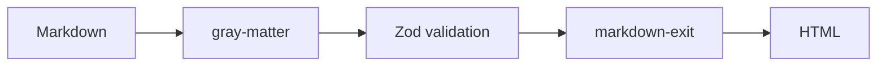

# はじめに

この記事では、**markdown-exit**を使ってContentLayer風のブログシステムを構築する方法を紹介します。

## 主な機能

markdown-exitとZodを組み合わせることで、以下の機能を実現できます:

- 型安全なコンテンツ管理
- ビルドタイム処理
- 非同期マークダウンレンダリング
- フロントマターのバリデーション

### コード例

```typescript
import { getAllPosts } from '@/lib/content'

const posts = await getAllPosts()
```

このコードで、すべての記事を型安全に取得できます。

## アーキテクチャ

システムは以下のレイヤーで構成されています:

1. **Loader** - マークダウンファイルの読み込み
2. **Processor** - HTML変換と計算フィールドの生成
3. **Public API** - Next.jsページから利用できるAPI

### 処理フロー



## まとめ

markdown-exitを使うことで、柔軟で型安全なブログシステムを構築できます。
ContentLayerに似た開発体験を提供しながら、より細かい制御が可能です。

### 次のステップ

- シンタックスハイライトの追加
- タグページの実装
- RSS フィードの生成
- 全文検索機能

ぜひお試しください！
